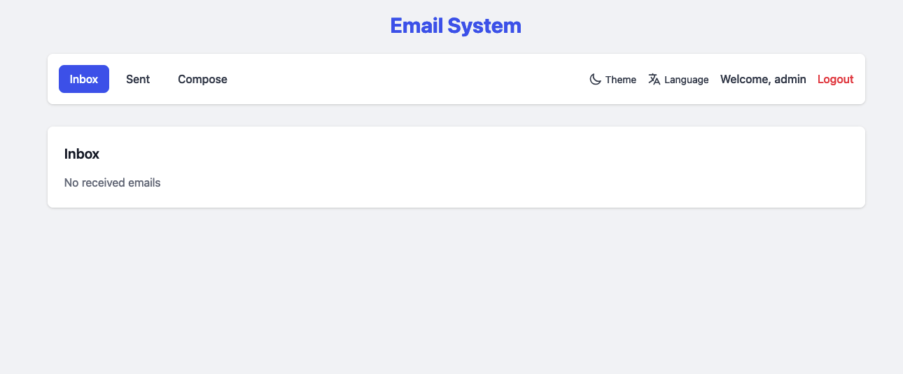
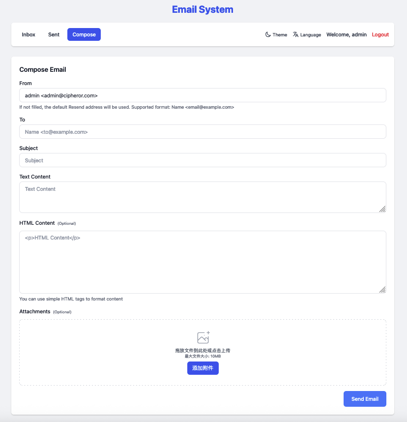
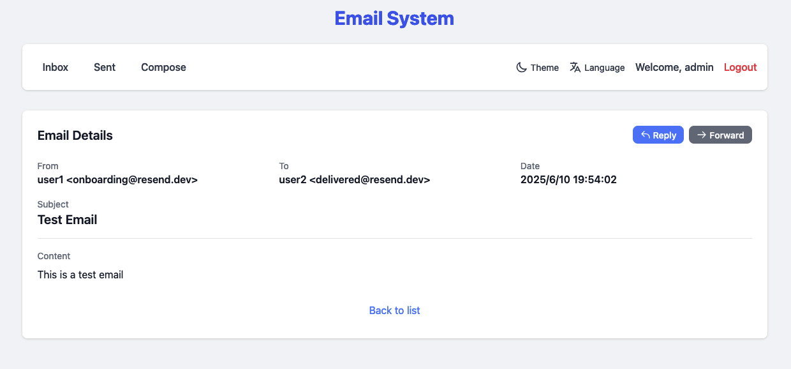
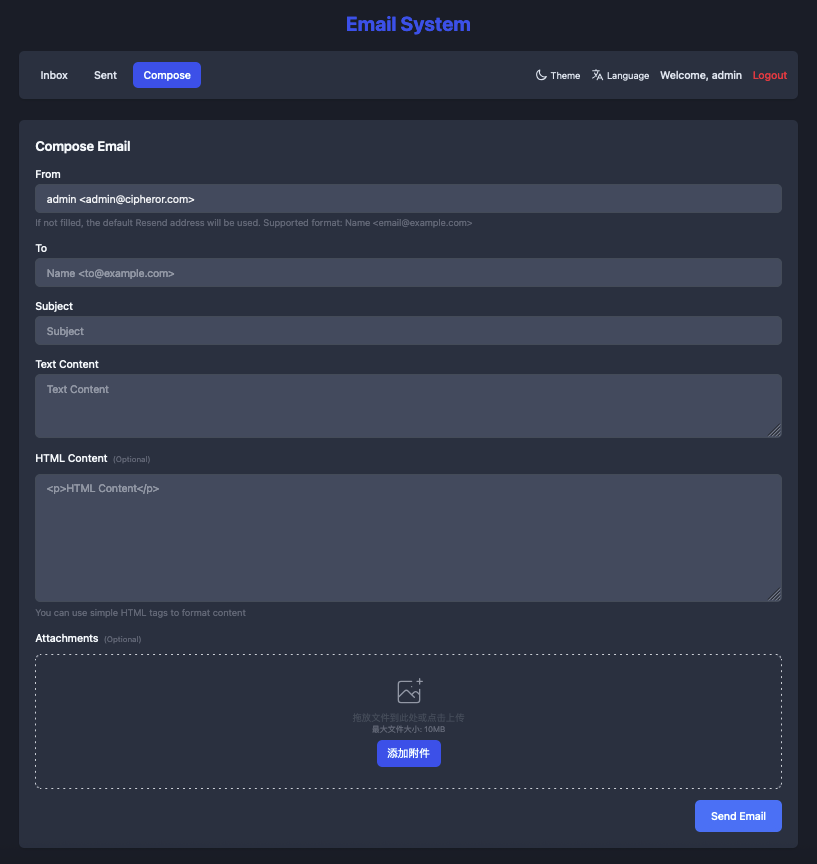
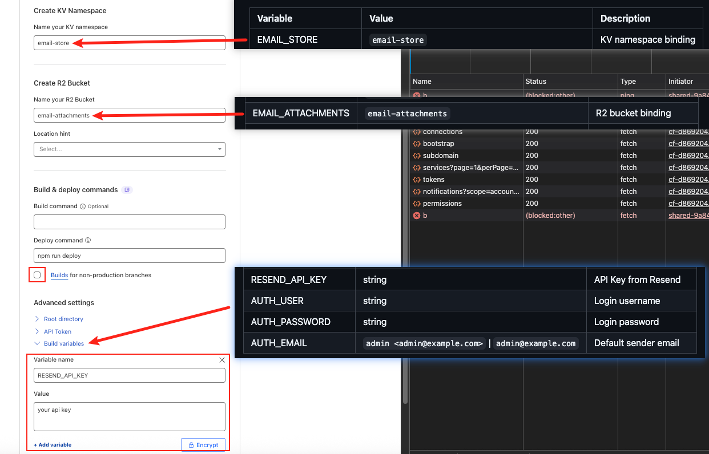

<div align="center">
  <h1>Cloudflare Workers Email System</h1>
  <p> English | <a href="/README-zh.md">简体中文</a></p>
  <p>A complete email management system built with Cloudflare Workers that allows you to send and receive emails through a modern web interface. Email sending is powered by the Resend API, while the system includes user authentication to ensure only authorized users can access the email system.</p>
</div>

## Features

- ✉️ Send emails (via Resend API)
- 📬 View sent emails
- 📨 View received emails
- 🔄 Email data storage using Cloudflare KV
- 🎨 Clean and modern user interface
- 🔐 Environment variable-based user authentication
- 📎 Email attachment support
- 🌐 Multi-language support (English/Chinese)
- 🎯 Responsive design with Tailwind CSS

## Tech Stack

- **Backend**: Cloudflare Workers
- **Framework**: Hono (lightweight web framework)
- **Email Service**: Resend API
- **Storage**: Cloudflare KV (key-value store)
- **File Storage**: Cloudflare R2 (object storage for attachments)
- **Frontend**: React
- **Styling**: Tailwind CSS
- **Validation**: Zod
- **Sessions**: Hono Sessions

## Project screenshots

### Inbox


### Sent


### Compose


### Email Details


### Dark Theme


## Quick Deploy

[](https://deploy.workers.cloudflare.com/?url=https://github.com/cipherorcom/emails)

You can use the "Deploy to Cloudflare" button above to deploy this project to your Cloudflare account with one click. During deployment, you'll need to:

1. Get a [Resend API Key](https://resend.com)
2. Login to your Cloudflare account
3. Set up environment variables:

   | Variable | Value | Description |
   |----------|-------|-------------|
   | EMAIL_STORE | `email-store` | KV namespace binding |
   | EMAIL_ATTACHMENTS | `email-attachments` | R2 bucket binding |
   | RESEND_API_KEY | string | API Key from Resend |
   | AUTH_USER | string | Login username |
   | AUTH_PASSWORD | string | Login password |
   | AUTH_EMAIL | `admin <admin@example.com>` \| `admin@example.com` | Default sender email |



## Project Setup

### 1. Configure Resend API

First, you need to create an account on [Resend](https://resend.com) and obtain an API key.

### 2. Configure Cloudflare Workers

Before deploying, make sure to modify the following in your `wrangler.toml` configuration file:

```toml
# KV namespace needs to be created in Cloudflare dashboard
[[kv_namespaces]]
binding = "EMAIL_STORE"
id = "your-kv-namespace-id" # Replace with your created KV namespace ID
preview_id = "your-dev-kv-id" # For local development

# R2 bucket for storing email attachments
[[r2_buckets]]
binding = "EMAIL_ATTACHMENTS"
bucket_name = "email-attachments" # Replace with your created R2 bucket name
preview_bucket_name = "email-attachments-dev" # For local development

# Environment variables
[vars]
# Resend email service API Key
RESEND_API_KEY = "your-resend-api-key" # Replace with your Resend API key

# Authentication credentials
AUTH_USER = "admin"      # Login username
AUTH_PASSWORD = "admin123"  # Login password
AUTH_EMAIL = "admin@example.com"  # User email, used as default sender
```

### 3. Install Dependencies and Run

```bash
# Install dependencies
npm install

# Local development
npm run dev

# Deploy to production
npm run deploy
```

## Email Receiving Setup

To receive emails, you need to set up email routing in the Cloudflare dashboard:

1. Log in to the Cloudflare dashboard
2. Navigate to "Email" > "Email Routing"
3. Set up your domain and create email routing rules
4. Create a rule that forwards emails to your Worker

## Project Structure

```
├── src/
│   ├── index.js                    # Main application entry point
│   ├── components/                 # UI components
│   │   ├── AttachmentUploader.js   # Attachment upload component
│   │   └── SettingsPanel.js        # Settings panel component
│   ├── api/                        # API handling modules
│   │   ├── settings.js             # Settings-related APIs
│   │   └── attachments.js          # Attachment handling APIs
│   ├── i18n/                       # Internationalization support
│   │   ├── index.js                # i18n entry point
│   │   ├── zh-CN.js                # Chinese translations
│   │   └── en-US.js                # English translations
│   ├── utils/                      # Utility functions
│   │   ├── attachments.js          # Attachment utilities
│   │   └── theme.js                # Theme utilities
│   └── db/                         # Database operations
│       ├── auth.js                 # User authentication
│       └── email-receiver.js       # Email receiving logic
├── wrangler.toml                   # Cloudflare Workers configuration
├── package.json                    # Project dependencies
└── LICENSE                         # License file
```

## Usage

Access the application at the root directory to see the following pages:

- `/` - Inbox page, displays received emails
- `/sent` - Sent page, displays sent emails
- `/compose` - Compose page, for sending new emails
- `/login` - Login page, authenticate with configured credentials
- `/settings` - Settings page, for configuring preferences

## API Endpoints

- `POST /api/send` - Send an email
- `GET /api/emails` - Get all emails
- `POST /api/login` - User login
- `POST /api/logout` - User logout
- `POST /api/attachments/upload` - Upload attachment
- `GET /api/attachments/:id` - Get attachment
- `DELETE /api/attachments/:id` - Delete attachment
- `GET /api/settings` - Get user settings
- `POST /api/settings` - Update user settings

## Development

### Prerequisites

- Node.js 16+
- Cloudflare account
- Resend account

### Local Development

1. Clone the repository
2. Install dependencies: `npm install`
3. Configure your `wrangler.toml` file
4. Run locally: `npm run dev`

### Deployment

1. Make sure your `wrangler.toml` is properly configured
2. Deploy: `npm run deploy`

## Features in Detail

### Email Management
- **Inbox**: View all received emails with pagination and search
- **Sent**: Track all sent emails with delivery status
- **Compose**: Rich text editor for composing emails with attachment support

### Attachment Support
- Upload files via drag-and-drop or file picker
- Store attachments in Cloudflare R2
- Download and preview attachments

### Authentication
- Secure login system using environment variables
- Session management with Hono Sessions
- Protected routes requiring authentication

### Internationalization
- Support for multiple languages (English and Chinese)
- Easy to add new languages
- Browser language detection

## Contributing

1. Fork the repository
2. Create your feature branch (`git checkout -b feature/amazing-feature`)
3. Commit your changes (`git commit -m 'Add some amazing feature'`)
4. Push to the branch (`git push origin feature/amazing-feature`)
5. Open a Pull Request

## License

This project is licensed under the MIT License - see the [LICENSE](LICENSE) file for details.

## Support

If you encounter any issues or have questions, please feel free to:
- Open an issue on GitHub
- Check the [Cloudflare Workers documentation](https://developers.cloudflare.com/workers/)
- Review the [Resend API documentation](https://resend.com/docs)
